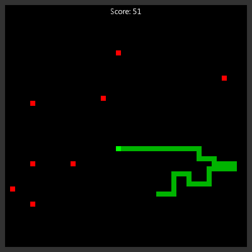

# 🐍 slang

[](https://github.com/radicazz/slang/actions/workflows/tests.yml)
[](https://github.com/radicazz/slang/blob/main/LICENSE.txt)
[](https://github.com/radicazz/slang/commits/main)

<!-- markdownlint-disable MD033 -->
<div style="display: flex; align-items: flex-start;">
    
    <div>
        <h2>About</h2>
        <p>My take on the classic snake game, built using C99, CMake and SDL3.</p>
        <h3>Gameplay</h3>
        <ul>
            <li>Use <code>arrows</code> or <code>WASD</code> to control the snake.</li>
            <li>Eat the red apples to grow longer and score points.</li>
            <li>Avoid running into yourself, or it's game over!</li>
            <li>Walls will wrap around to the other side of the screen.</li>
            <li>Use <code>esc</code> to pause and unpause the game.</li>
        </ul>
    </div>
</div>
<!-- markdownlint-enable MD033 -->

## Building

> This project uses git submodules to manage dependencies. They may require additional dependencies themselves.

- [C Compiler](https://en.cppreference.com/w/c.html) (e.g., GCC, Clang, MSVC)
- [CMake](https://cmake.org/) (version 3.16 or higher)
- [SDL3](https://www.libsdl.org/) (automatically handled via submodules)

Start off by cloning the repository with its submodules:

```bash
# Clone the repository with submodules
git clone --recurse-submodules https://github.com/radicazz/slang.git
cd slang
```

Then, configure and build the project using CMake:

```bash
# Configure & build the project
cmake -S . -B build
cmake --build build
```

The compiled executable will be located in the `build` directory.

## License

This project is licensed under the GNU General Public License v3.0 - see the [LICENSE.txt](LICENSE.txt) file for details.
